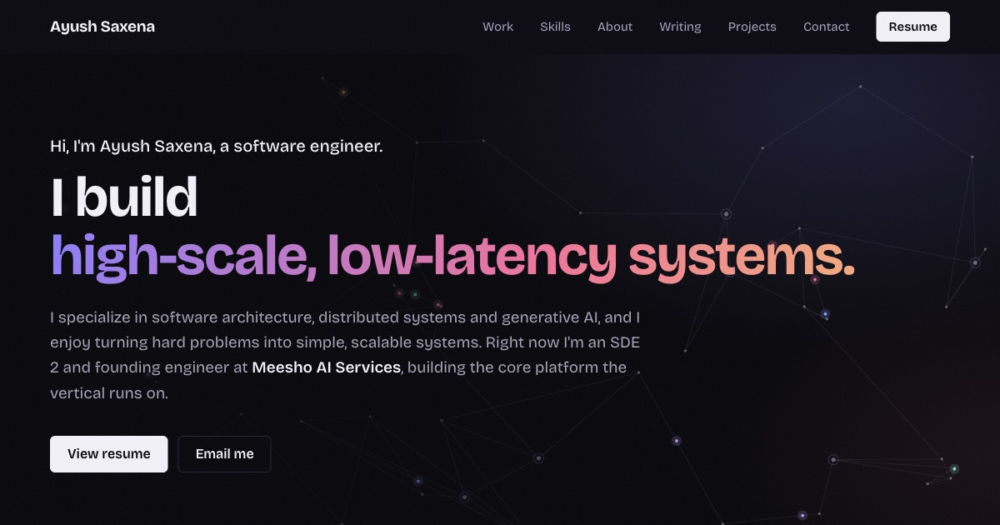

# Ayush Saxena — Portfolio

My personal site: work, skills, writing and side projects. Live at **[ayushsaxenaa.netlify.app](https://ayushsaxenaa.netlify.app/)**.



## Stack

- **React 18** with **styled-components** for the UI
- **Vite** for dev and builds
- **Three.js** for the hero's 3D datacenter scene, lazy-loaded only when WebGL is available and the hero is on screen
- **Build-time pre-rendering:** the page is rendered to static HTML at build time and hydrated in the browser, so search engines and link previews get the full content without running JavaScript
- **Netlify** for hosting

## Run locally

Requires Node.js 24 (see `.nvmrc`).

```bash
nvm use            # picks up Node 24 from .nvmrc
npm install
npm run dev        # http://localhost:3000
```

Other scripts:

| Command | What it does |
| --- | --- |
| `npm run build` | Builds the client bundle, renders the page to HTML and writes it all to `build/` |
| `npm run preview` | Serves the production build locally |

## Editing content

Almost all content lives in [`src/data/ProjectData.js`](src/data/ProjectData.js): hero phrases, experience and highlights, skills and tools, recognition, blog posts, projects, and social links. Update it and the page follows.

Tool icons are SVGs in `public/icons/`.

SEO metadata (title, description, Open Graph tags and JSON-LD) lives in [`index.html`](index.html). If the site URL changes, update it there and in `public/sitemap.xml` and `public/robots.txt`.

## Project structure

```
index.html              page shell, meta tags, structured data
src/
  components/           one folder per section (Hero, Experience, Skills, ...)
  data/ProjectData.js   site content
  entry-server.jsx      server render used for pre-rendering
  index.jsx             client entry (hydrates the pre-rendered HTML)
scripts/prerender.js    injects the rendered HTML and styles into build/index.html
public/                 fonts, icons, favicons, OG image, sitemap
netlify.toml            Netlify build command, output folder and Node version
```

## Deploys

Netlify builds from this repo using `netlify.toml`. Every push to `master` deploys to production.
